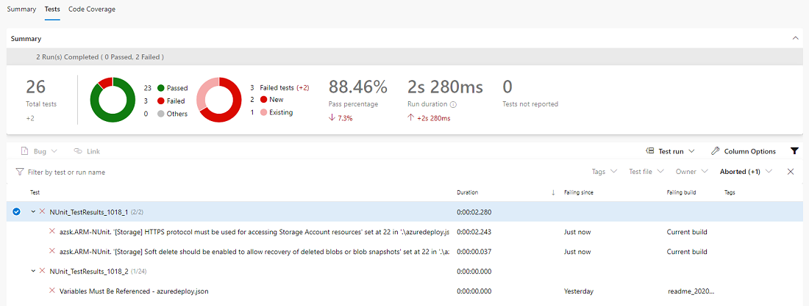

## Purpose

This contains pre-built pipelines for ARM template deployment. The build steps run ARM-TTK, AZSK, and submits the templates in validate mode. The following extensions are used as part of the build pipelines and need to be installed into your Azure DevOps Org [AZSK to NUNIT](https://marketplace.visualstudio.com/items?itemName=ALMMechanics.AzskNUnit&ssr=false#overview) and [AZSK](https://marketplace.visualstudio.com/items?itemName=azsdktm.AzSDK-task).

ARM-TTK and AZSK tests are run in the build step to insure best practices are being followed in ARM template structure and security.

