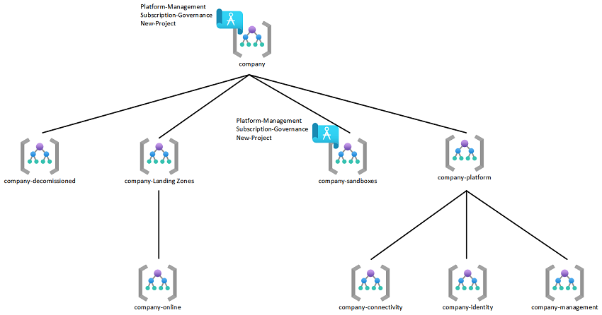
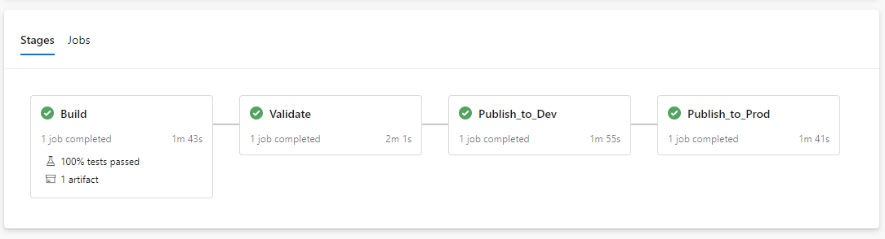

## Purpose

This repo contains pre-built Blueprints and Azure DevOps Pipelines to streamline the deployment of a well-governed Azure environment. This repo builds off the work of the [Cloud Adoption Framework](https://docs.microsoft.com/en-us/azure/cloud-adoption-framework/) and [Enterprise Scale](https://docs.microsoft.com/en-us/azure/cloud-adoption-framework/ready/enterprise-scale/) architectures.

---

### Navigation

* [Contents](#Prepare-Your-Environment)
* * [Enterprise Scale](#Enterprise-Scale)
* * [Blueprints](#Blueprints)
* * * [Platform-Management](#Platform-Management)
* * * [Subscription-Governance](#Subscription-Governance)
* * * [New-Project](#New-Project)
* * [CI/CD Deployment Pipelines](#Azure-DevOps)
* [Getting started](#Getting-Started)

---

### Enterprise Scale Scaffolding

The deployment of Enterprise Scale into your environment creates a management group structure and custom policy scoped to the top level management group. A depiction of this hierarchy can be found below.

### Blueprints

This repo contains a set of Azure Blueprints that will be provisioned via pipeline and scoped to the top level management group (prod) and the "Sandbox" (dev) management group Enterprise Scale builds.

- #### 1. Platform-Management
    This blueprint is used to establish the landing zone for the platform management subscription. It is recommended to set the Blueprint assignment to "read-only" in order to prevent modification of the resources created by this Blueprint.

- The following items are deployed as part of this Blueprint:
    - User Assigned Managed Identity
    - Storage Account
    - Log Analytics Workspace (365 Day Retention)
    - Azure Sentinel
    - Key Vault

- #### 2. Subscription-Governance
    This blueprint is used to establish base governance for an Azure subscription. It is recommended to set the Blueprint assignment to "read-only" in order to prevent modification of the resources and policies created by this Blueprint.
- The following items are deployed as part of this Blueprint:

    - Centralize Activity Logging to Platform-Management Workspace
    - Allowed Locations for Resources (East US 2/Central US)
    - Allowed Locations for Resource Groups (East US 2/Central US)
    - Audit Virtual Machines with Pending Reboot
    - Audit if budgets do not exist in subscriptions and resource groups
    - Enable Azure Security Center (Standard/Free) and Centralize to Platform-Management Workspace
    - Enable Azure Security Policy
    - Deploy Network Watcher for New Networks
    - Deny IP Forwarding on Virtual Machine NIC's
    - Deny 'Basic' VPN Gateway
    - Deny Creation of PaaS Services Without Network ACL:
        - Azure Kubernetes Service
        - CosmosDB
        - Key Vault
        - MariaDB
        - MySQL
        - PostgreSql
        - SQL DB
        - Azure Storage
    - Audit Service Endpoints for Resources:
        - Azure Container Registry
        - App Service
        - Event Hub
        - Service Bus
    - Enable Base Set of Azure Subscription Alerting
        - IAM Changes
        - NSG Modification
        - Policy Assignment Deletion
        - Public IP Creation
        - Resource Group Creation
        - Route Table Modification
        - VNet Modification
    - Enable Base Tagging Policy
        - Deny Resource Group Creation Without Tags
        - Inherit Tags on Resources from Resource Group
            - Application Name
            - Application Owner
            - Business Criticality
            - Contact Email
            - Cost Center
            - Data Classification
    - Allowed VM SKU's

        | VM SKU | CPU | MEMORY (GB) | USE |
        | --- | --- | --- | --- |
        | Standard_B1ms | 1 | 2 | Burstable/Test |
        | Standard_F2s_v2 | 2 | 4 | Production |
        | Standard_B2s | 2 | 4 | Burstable/Test |
        | Standard_B2ms | 2 | 8 | Burstable/Test |
        | Standard_D2s_v4 | 2 | 8 | Production |
        | Standard_B4ms | 4 | 16 | Burstable/Test |
        | Standard_D4s_v4 | 4 | 16 | Production |
        | Standard_F8s_v2 | 8 | 16 | Production |
        | Standard_B8ms | 8 | 32 | Burstable/Test |
        | Standard_D8s_v4 | 8 | 32 | Production |
        | Standard_E8s_v3 | 8 | 64 | Production |
        | Standard_F16s_v2 | 16 | 32 | Production | 
        | Standard_E16s_v3 | 16 | 128 | Production |
---

- #### 3. New-Project
    This blueprint is used to establish the landing zone for new projects. It is recommended to set the Blueprint assignment to "read-only" in order to prevent modification of the resources created by this Blueprint.
- The following items are deployed as part of this Blueprint:
    - Resource Group with Required Tags
        - Application Name
        - Application Owner
        - Business Criticality: Allowed Values (Tier0, Tier1, Tier2, Tier3)
        - Contact Email
        - Cost Center
        - Data Classification Allowed Values (Public, Internal, Restricted, Confidential)
    - RBAC Role (Single user or group scoped to the Resource Group above with 1 of the following roles)
        - Contributor
        - Virtual Machine Contributor
        - Storage Account Contributor
        - Network Contributor
        - Key Vault Contributor
        - SQL DB Contributor
    - Budget Alert to Contact Email of Resource Group
        - Alerts at 80% of monthly spend
---

### Azure DevOps

Each Blueprint has a set of Azure DevOps YAML pipelines that can be imported to jump start infrastructure as code deployments. There are a handful of custom Pester tests that run against the Blueprints to highlight how infrastructure deployments can be aligned to defined specifications and test procedures.

---
### Getting Started

1. Deploy the management group scafolding structure as per image above   

1. Create a service principal in Azure to be used for pipeline deployments
1. Assign the service principal to the top level management group -created in prior step- with "Contributor" permissions
1. Create a new Azure DevOps (ADO) project
    - > If you do not have an existing ADO environment this can be done for free [here](https://azure.microsoft.com/en-us/services/DevOps/?nav=min).
1. Import this repo into your new ADO project
1. In your ADO project settings, create a service connection with the service principal created in a prior step
1. Import the ADO pipelines from each Blueprint pipeline folder
1. In ADO, create a branch protection policy on main (prod)
1. Clone the ADO repo to your local machine and use your preferred IDE, in this case is Visual Studio Code (VSC)
1. In VSC, create a new branch named "variable-update" (or any name you prefer)
1. Search the Blueprints folder in your local repo and replace the following
    - &lt;yourConnectionName> = Your ADO service connection name
    - &lt;yourProdSuborMgtGroup> = Your top level management group
    - &lt;yourDevSuborMgtGroup> = Your sandbox management group
1. Save, commit, and push
1. Validate all pipelines run to success and a .1 version of the Blueprint published at the sandbox scope
1. Test Blueprint assignment in sandbox subscription(s)
    - Assign Platform-Management to central logging subscription
    - Assign Subscription-Governance to all subscriptions
    - Assign New-Project to create a resource group for any new workload
1. Once satisfied issue a pull request (PR) to merge changes into main
1. Verify all pipelines run to success and a .1 version of the Blueprint is published at the top level management group

